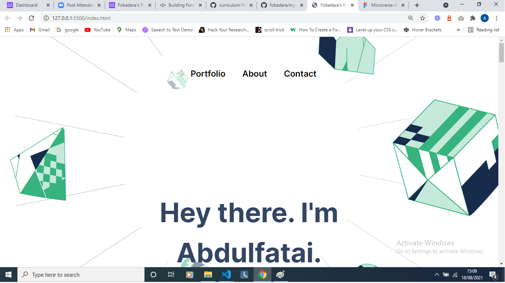
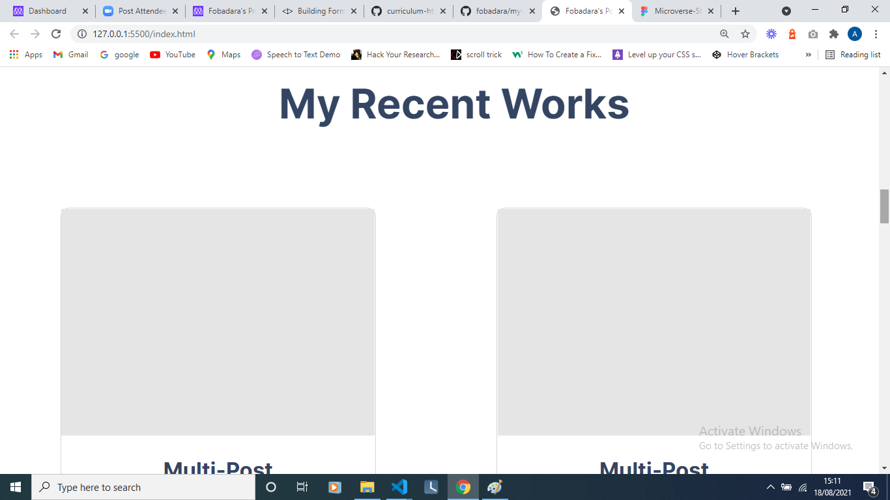
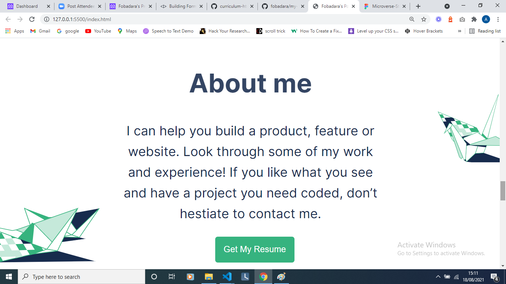
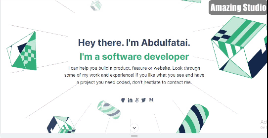

## My Portfolio Site

This is a portfolio site inspired by figma

# 
<a href="https://fobadara.github.io/my-portfolio-site-2/" text="bold">Live Demo</a>

# Description

> A site showing some of my best works structured beautifully. This site is fully responsive and compatible to all screen sizes and all device. A combination of flexbox and grid are used to bring this site to life. It is divided into a navigation section, an homepage section, a work section, an about section and a footer section.

# Built With :hammer:

● HTML

● CSS

● Linters

# Getting Started

To get a local copy up and running follow these simple example steps.

⬜ clone the app by running this command `git clone https://github.com/fobadara/my-portfolio-site-2.git`

⬜ Run this command `cd my-portfolio-site-2`

⬜ Open in browser

# Prerequisites

You will be needing:

⬜ A web browser to view output

⬜ A text editor or terminal

# Run tests

You can run tests by following these steps:

⬜ commit and push your changes

⬜ navigate to pull request

⬜ I have created a pull request which runs linters or you could simply create a pull rrequest of your own

# Authors

👤 Abdulfatai Badara

GitHub: github.com/fobadara

Twitter: fob90s@twitter.com

# 🤝 Contributing

Contributions, issues, and feature requests are welcome!

Feel free to check the issues page.

# Show your support

Give a ⭐️ if you like this project!

# Acknowledgments

Hat tip to anyone whose code was used

Lots of appreciations to my wife, Habeebah who keeps supporting me

# 📝 License

This project is licensed by [MIT](LICENSE)
